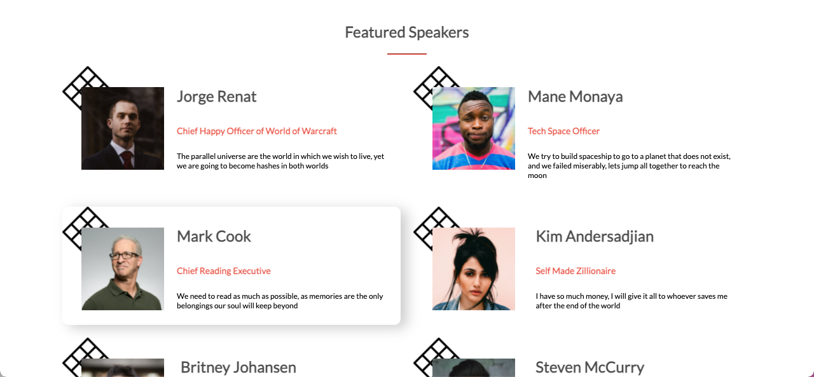

# End of the World

This page will be my first project as a programmer student.

The live version of the webpage is here [The End of the World Website](https://benjp009.github.io/end-of-the-world/)

### Highlights 🚀
As part of the design, I have chosen to create a page for an fictive event of the end of the world.

#### The homepage

##### Some box made with Javascript and dynamic design

#### Speakers

#### Mobile menu

#### Mobile dynamic design

### Pair Programming 🎳

For the milestone project, there is no Pair Programming required, so I have been working on it by myself.

### Extra information

If you like this project, feel free to reach out to me on [LinkedIn](http://linkedin.com/en/benjaminpatin)

Original design idea by [Cindy Shin in Behance](https://www.behance.net/adagio07).
